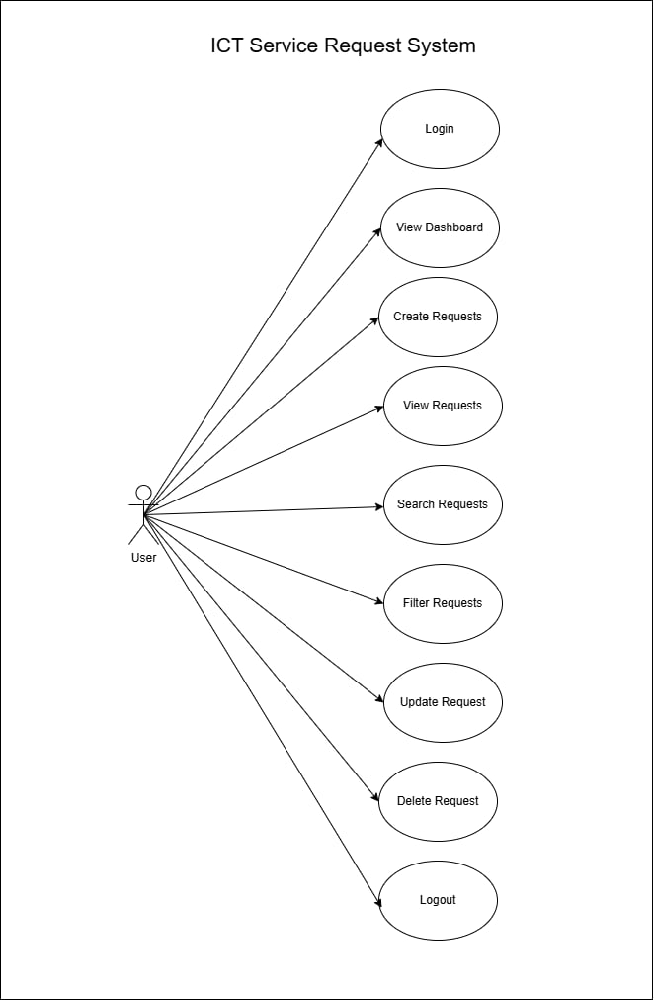
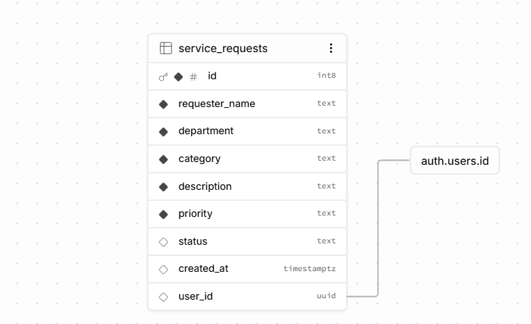
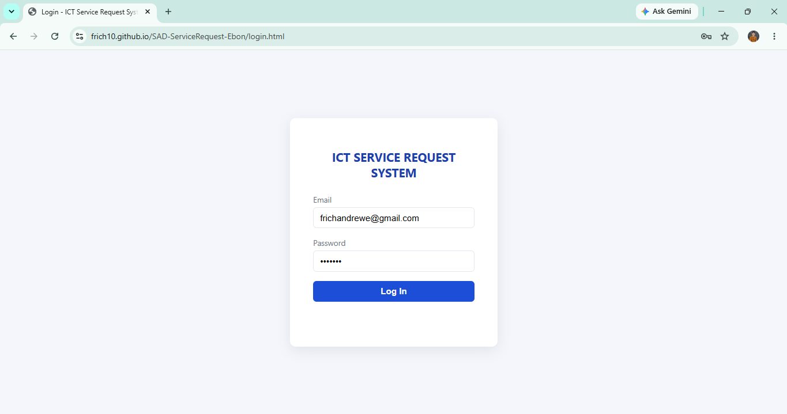
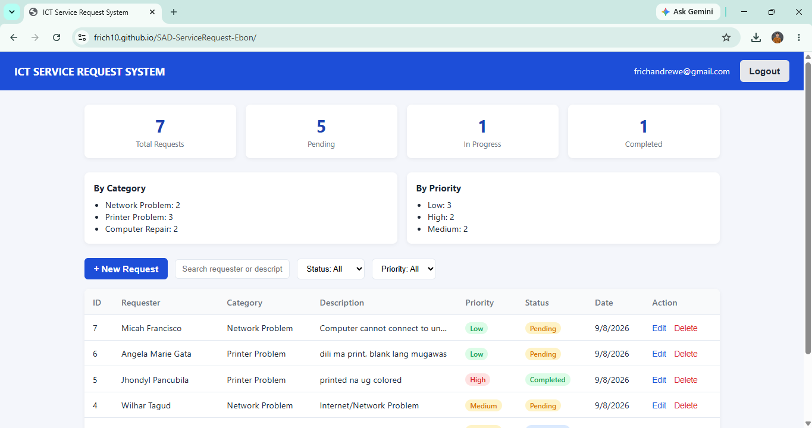
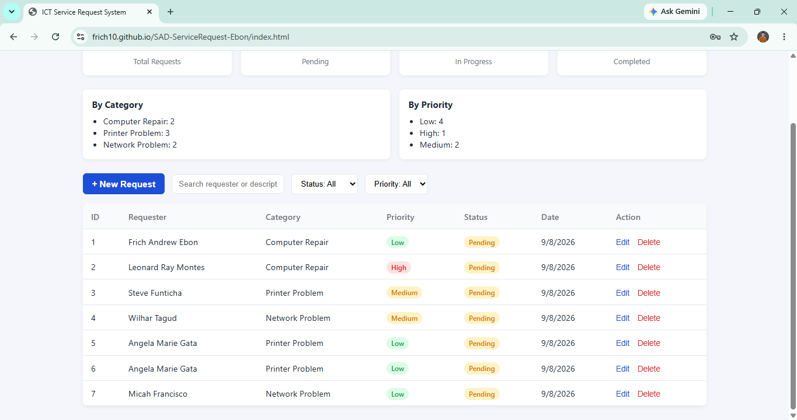
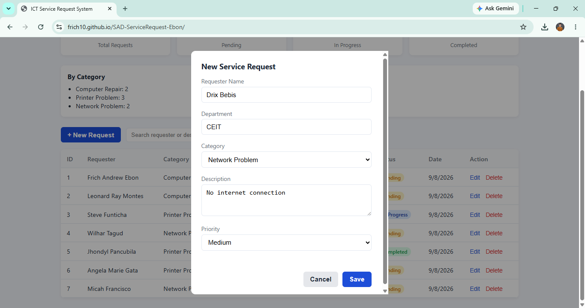
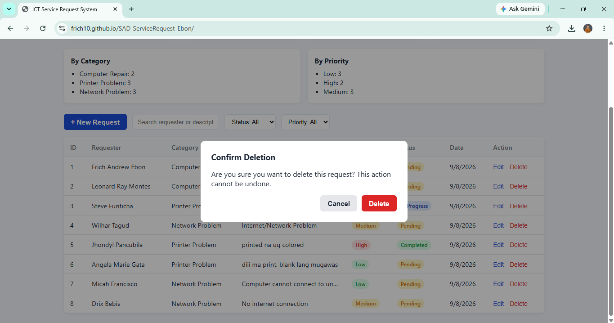

# ICT Service Request Management System

A web-based CRUD system for logging and tracking ICT service requests, built with
plain HTML/CSS/JavaScript and a Supabase (PostgreSQL + Auth) backend, deployed on
GitHub Pages.

**Course:** Systems Analysis and Design (SAD) — Laboratory Exercise 3

---

## 1. Student Information

- **Student:** Frich Andrew M. Ebon
- **Section:** 3A
- **GitHub Repository:** https://github.com/Frich10/SAD-ServiceRequest-Ebon
- **Live System:** https://frich10.github.io/SAD-ServiceRequest-Ebon/login.html

---

## 2. Problem Statement

The university's ICT office receives technical support concerns through different
channels such as verbal reports, text messages, and social media. Because there is
no central record, some requests may be forgotten, duplicated, or left untracked.

This project provides a centralized web-based system where authorized users can
log, monitor, search, and update ICT service requests. It also provides a dashboard
to show the number of pending, in-progress, and completed requests.

---

## 3. System Features

- Login and Logout
- Dashboard with request summaries
- Create service requests
- View service requests
- Update service requests
- Delete service requests
- Search by requester name, description, priority, or status
- Filter by status
- Filter by priority
- Supabase Authentication
- Row Level Security (RLS)

---

## 4. Use Case Diagram

The Use Case Diagram shows the main actions that a user can perform in the ICT
Service Request Management System.



---

## 5. Entity Relationship Diagram (ERD)

The ERD shows the relationship between the Supabase authenticated users and
the service requests stored in the database.



### Relationship

One user can create many service requests (1:M).

The `user_id` field in the `service_requests` table is connected to
`auth.users.id` in Supabase.

---

## 6. Requirements Traceability Matrix

| Req. ID | Requirement | System Feature | Test |
|---------|-------------|----------------|------|
| FR-01 | User can log in | Login Page | TC-01 |
| FR-02 | User can create request | Request Form | TC-02 |
| FR-03 | User can view requests | Request Table | TC-03 |
| FR-04 | User can update request | Edit Function | TC-04 |
| FR-05 | User can delete request | Delete Function | TC-05 |
| FR-06 | User can search | Search Function | TC-06 |
| FR-07 | User can filter | Filter Function | TC-07 |
| FR-08 | System displays summaries | Dashboard | TC-08 |
| FR-09 | System is accessible online | GitHub Pages | TC-09 |

---

## 7. Screenshots

### Login Page



### Dashboard



### Service Request Table



### Create/Edit Request



### Delete Confirmation



---

## 8. Testing Results

| Test ID | Test Scenario | Expected Result | Result |
|---------|---------------|-----------------|--------|
| TC-01 | Login using valid account | Dashboard appears | PASS |
| TC-02 | Submit valid request | Request is saved | PASS |
| TC-03 | Display requests | Existing records appear | PASS |
| TC-04 | Modify request | Changes are saved | PASS |
| TC-05 | Delete request | Confirmation appears and record is removed | PASS |
| TC-06 | Search requester, description, priority, or status | Matching records are displayed | PASS |
| TC-07 | Filter by status and priority | Matching records are displayed | PASS |
| TC-08 | View dashboard summaries | Total, Pending, In Progress, and Completed counts are displayed | PASS |
| TC-09 | Open deployed URL | Application loads online | PASS |

---

## 9. Technologies Used

- HTML
- CSS
- JavaScript
- Supabase PostgreSQL
- Supabase Authentication
- Supabase Row Level Security (RLS)
- GitHub
- GitHub Pages

---

## 10. Deployment

**GitHub Repository:**  
[https://github.com/Frich10/SAD-ServiceRequest-Ebon](https://github.com/Frich10/SAD-ServiceRequest-Ebon)

**GitHub Pages:**  
[https://frich10.github.io/SAD-ServiceRequest-Ebon/](https://frich10.github.io/SAD-ServiceRequest-Ebon/)

---

## 11. Project Structure

```text
sad-service-request/
├── index.html
├── login.html
├── css/
│   └── style.css
├── js/
│   ├── supabase.js
│   ├── auth.js
│   └── app.js
├── documentation/
│   ├── use-case-diagram.png
│   ├── erd.png
│   ├── screenshots/
│   │   ├── login.png
│   │   ├── dashboard.png
│   │   ├── table.png
│   │   ├── modal.png
│   │   └── delete.png
│   ├── system-analysis.md
│   └── setup.sql
└── README.md